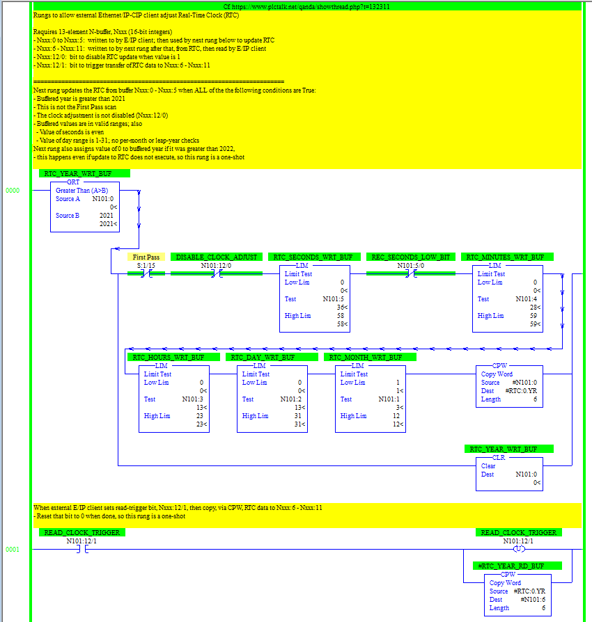

## SLC adjust clock

Python script to adjust Calendar/Real-Time Clock of SLC/MicroLogix

#### Manifest
====
* slc_adjust_time.py - Python script
* slc_adjust_clock.RSS - RSLogix 500 program
* slc_adjust_clock.pdf - PDF of RSLogix 500 program
* sntp.py - Unused script implementing minimal SNTP interaction
