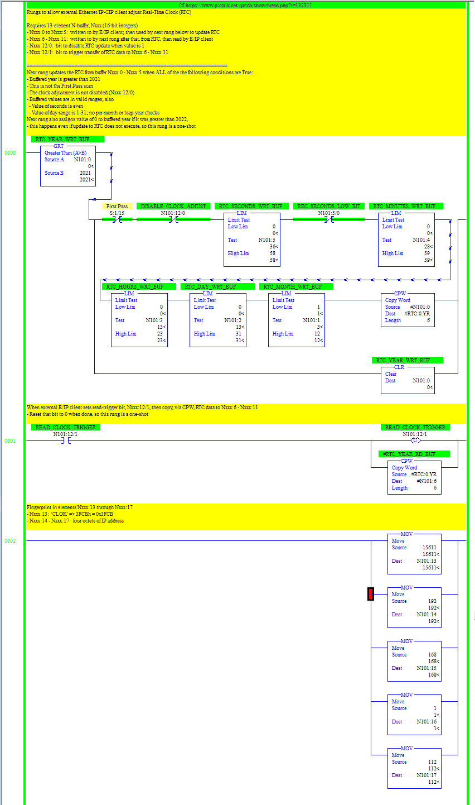

## SLC adjust clock

Python script to adjust Calendar/Real-Time Clock of SLC/MicroLogix using
[ottowayi/pycomm3 module](https://github.com/ottowayi/pycomm3)

### Minimal usage:
* Update clock on MicroLogix 1100 at IP address 192.168.1.112 using N-file 100:
```
    SLC_TIME("192.168.1.112",100).check_and_update()
```
* Print out RSLogix 500 mnemonics for the PLC side of that program:
```
    print(SLC_TIME("192.168.1.112",100).dump_logix_500_program())
```

------
#### Manifest

* slc_adjust_clock.py - Python script
* slc_adjust_clock.RSS - RSLogix 500 program
* slc_adjust_clock.pdf - PDF of RSLogix 500 program
* sntp.py - Unused script implementing minimal SNTP interaction
